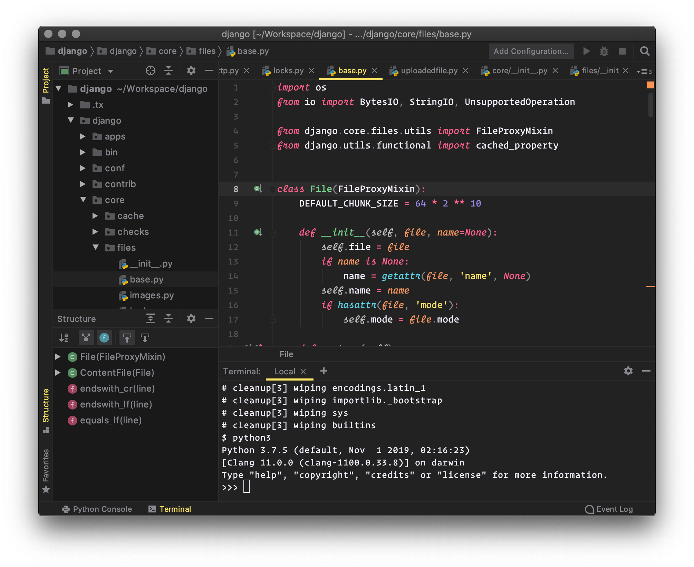

# Monokai Pro Forked for JetBrains

Jonathan Esposito's unofficial Monokai Pro theme for JetBrains forked by Nikita Buyevich.
This fork includes fixes to various bugs in Jonathan Esposito's current implementation of the Monokai Pro theme.
This plugin includes the default theme, including all four filters: Machine, Octagon, Ristretto, and Spectrum. Credit goes to the original creator: <a href="https://monokai.pro">https://monokai.pro</a>.

## Recommended Font

- [Fira Code Retina](https://github.com/tonsky/FiraCode)
- Font ligatures enabled

## Screenshots

#### Monokai Pro:


#### Filter Machine:


#### Filter Octagon:


#### Filter Ristretto:


#### Filter Spectrum:



## Future Improvements

- It's currently not possible to change the foreground color of the selected file in the project tree panel.

## Development

The colors were originally pulled from the Material Theme UI plugin, and modified to better match the official versions of Monokai Pro on Sublime and VSCode (cleaner borders, softer hovers, etc). I also updated the theme to use a handful of base colors I could match with known colors used in iTerm and Sublime/VSCode.

To create the filters, I made a script that maps the default colors to the filter colors, and replaces each value. The filter colors were discovered using iTerm and Sublime.

Whenever the default theme is modified (Monokai Pro F.theme.json and Monokai Pro F.xml), this script should be run to update the filters:

```python
python filters.py
```
